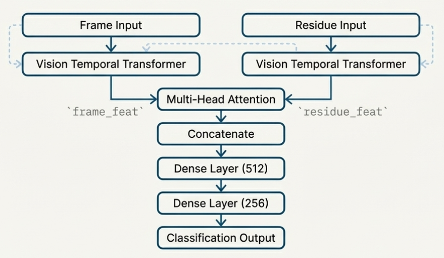
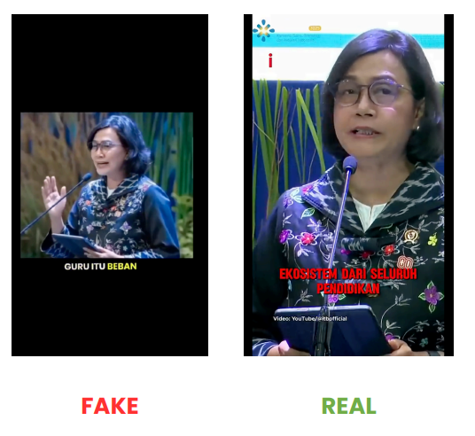

# Deteksi Deepfake Video Berbasis VTT Vision Temporal Transformer

## 🔎 Deskripsi  
This project aims to build a **deepfake video detection system** using Vision Temporal Transformer (VTT) to simultaneously modeling spatial and temporal relationship of every sequential frame. We also experimented with various training dataset as well as variation of pre-processing steps to achive the best performing model.

## Install Dependencies
clone repository
```bash
# Clone repo
git clone https://github.com/nilammufidah19/CVL-LipSyncing-DeepfakeVideo-Task.git
cd CVL-LipSyncing-DeepfakeVideo-Task
```

install dependencies
```bash
pip install -r requirements.txt
```

## Referensi

📄 Reference Paper: [paper](https://arxiv.org/abs/2504.01470)

💻 Reference Code: [github](https://github.com/skrantidatta/LIPINC-V2)

📊 Dataset:
1. [Kaggle - FaceForensics](https://www.kaggle.com/datasets/xdxd003/ff-c23),
2. [Kaggle - DFD](https://www.kaggle.com/datasets/sanikatiwarekar/deep-fake-detection-dfd-entire-original-dataset?select=DFD_original+sequences),
3. [Kaggle - DFDC](https://www.kaggle.com/competitions/deepfake-detection-challenge),
4. [Kaggle - CelebDF](https://www.kaggle.com/datasets/reubensuju/celeb-df-v2)
5. [Data - Inference](https://drive.google.com/drive/folders/171EcxZ3ESN63CFhzcz3vbMvzRwBjT8Re?usp=sharing)

🎬 Presentation Video: [youtube](https://youtu.be/4aHN4INmo2c)


## Method
The LIPINC model is designed to simultaneously capture spatial relations and temporal dependencies in videos.

Key components:
1. Vision Temporal Transformer (VTT) – Analyzes frame-wise and cross-frame features.
2. Dual Input (Temporal Residuals) – Enhances motion signals and transitional inconsistencies.
3. Dual Loss Function – Optimizes classification while encouraging feature consistency.

Model Architecture (LIPNIC):



## Dataset Configuration
| **Dataset Configuration** | **Total Datasets** | **MediaPipe Used** |
|-------------------------------|---------------------|----------------------|
| **V1** CelebDF V2            | 1                   | No                    |
| **V2** FaceForensics++       | 1                   | No                    |
| **V3** CelebDF, FF++         | 2                   | No                    |
| **V4** FF++, DFD, DFDC       | 3                   | No                    |
| **V5** FaceForensics++       | 1                   | Yes                   |

## Result Eksperimen
| **Method** | **V1** | **V2** | **V3** | **V4** | **V5** |
|-----------|--------|--------|--------|--------|--------|
| **Data Counts (Training/Val/Test)** | Total: 1,180 Split: 826/177/177 | Total: 2,000 Split: 1600/300/300 | Total: 3,180 Split: 2226/477/477 | Total: 2,880 Split: 2016/432/432 | Total: 2,000 Split: 1600/300/300 |
| **Recall Real Videos** | **0.89** | 0.87 | 0.41 | 0.75 | 0.70 |
| **Macro F1** | 0.46 | 0.39 | 0.55 | **0.85** | 0.62 |
| **AP** | 0.5564 | 0.4656 | 0.5921 | **0.8889** | 0.6917 |
| **ROC-AUC** | 0.5582 | 0.4352 | 0.5921 | **0.9256** | 0.6866 |
| **IOU** | 0.1616 | 0.0859 | 0.4444 | **0.7675** | 0.4225 |

## Result Test Inference
| **Method** | **V1** | **V2** | **V3** | **V4** | **V5** |
|-----------|--------|--------|--------|--------|--------|
| **Recall Real Videos** | 0.96 | 0.88 | 0.94 | 0.80 | 0.08 |
| **Macro F1** | 0.3243 | 0.3985 | 0.38 | 0.7494 | 0.4165 |
| **AP** | 0.5 | 0.4955 | 0.5 | 0.6944 | 0.5208 |
| **ROC-AUC** | 0.48 | 0.49 | 0.5 | 0.75 | 0.54 |
| **IOU** | 0 | 0.0893 | 0.0566 | 0.5833 | 0.5208 |
| **Latency** | 0.1855 s | 0.2054 s | 0.1819 s | 0.1988 s | 0.3072 s |

Example detection result:



## Demo
Try the experiment results online:

👉 Streamlit App: [streamlit](https://lipsyncdeepfake-detection.streamlit.app/)

Or run locally:
```bash
cd streamlit_app
python app.py
```

### Conclusion 
- Scale & Diversity Improve Performance,
The best performance (ROC-AUC 0.9256) was achieved using three datasets (V4), showing the importance of data generalization.

- Effectiveness of LIPINC Architecture,
The combination of VTT, temporal residual inputs, and consistency loss is highly effective at capturing subtle spatio-temporal inconsistencies in deepfake videos.

- Value of Preprocessing,
Accurate face alignment (MediaPipe) can substitute data diversity when training data is limited.

## Contributor
@ikhlamal
@sisiflorensia
@nilammufidah19
@maggiexchan
